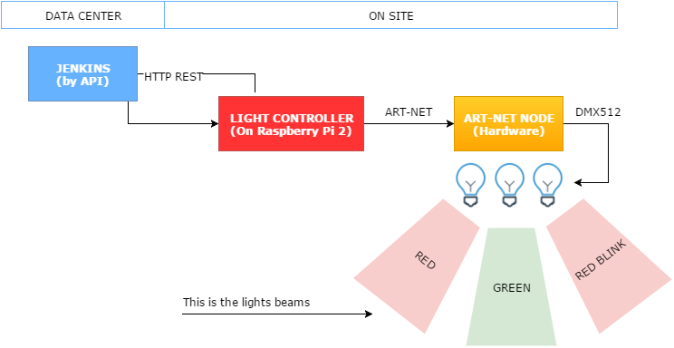
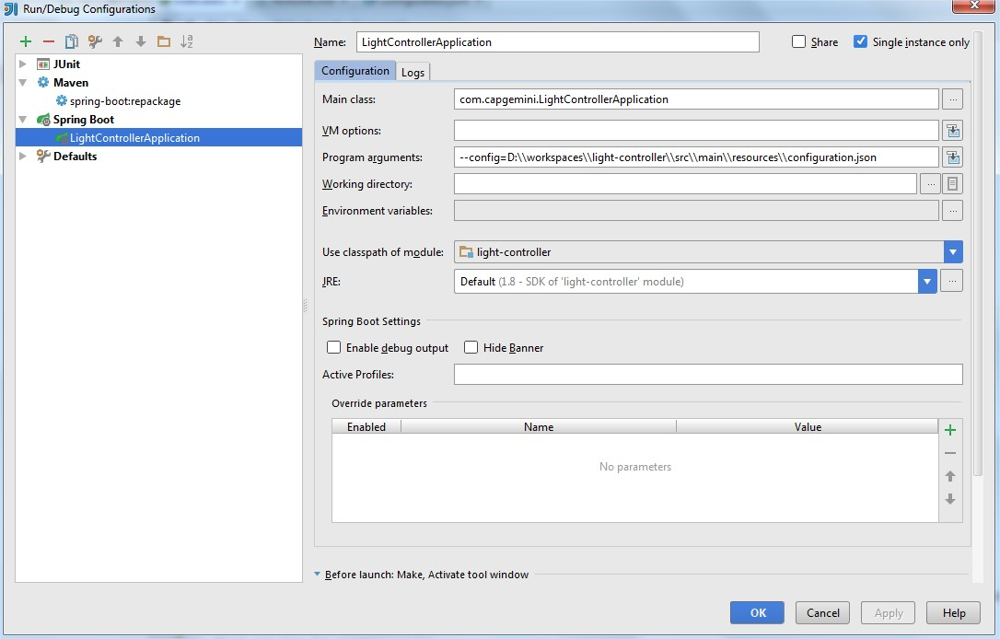
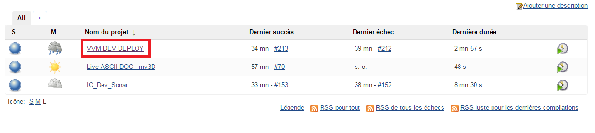
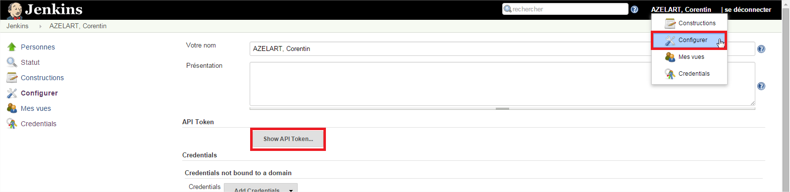

= Light-Controller
Corentin Azelart <corentin.azelart@capgemini.com>
:toc: left
:sectnums:

== Global

== Network
We use two IP address :
* One for the light-controller installed on raspberry pi
* One for the Art-Net node
Controllers must be in the same network to work, we use the broadcast address

== The project
=== Where is the code
The code is on : https://github.com/my3D-Team/light-controller[Github]

=== The language
JAVA with Spring Boot.

=== How to setup my development station
* Install IntelliJ 14 or more
* Create a new launcher with the main class and a configuration.json file

=== Passwords :
|===
| Node | Type | IP | Login | Password
| Raspberry | SSH | 10.67.57.95 | pi | raspberry
|===

== Raspberry
=== First Installation
* See on raspberrypi.org to install OS on SD-CARD : https://www.raspberrypi.org/downloads/raspbian/[Raspbian]
* Install JAVA8
[source,xml]
----
sudo apt-get update
sudo apt-get upgrade
sudo apt-get install openjdk-8-jdk
----
* Copy the project file resources/light-controller to /etc/init.d/light-controller
* Set auto-start at boot : sudo update-rc.d light-controller defaults

=== Deploy a new Version of light-controller
1. For build the jar in your PC play the maven job : clean install spring-boot:repackage -Dmaven.test.skip
2. Connect on Raspberry in SSH and put the file light-controller-0.0.1-SNAPSHOT.jar to /home/pi/light-controller-0.0.1-SNAPSHOT.jar
3. If you will change the configuration, copy configuration.json to /home/pi/configuration.json

=== Start and stop the service
* To start :
[source,xml]
----
sudo /etc/init.d/light-controller start
----
* To stop :
[source,xml]
----
sudo /etc/init.d/light-controller stop
----
* The starting phase can be long. Check the /var/log/light-controller.log to check log
[source,xml]
----
tail -f /var/log/light-controller.log
----

== Configuration
The configuration file must be in present in /home/pi/configuration.json
This is a sample of JSON configuration file
[source,json]
----
{
  "lightNetworkErrorColor": "FFDD00",
  "lightNetworkErrorEffect" : "BLINK",
  "jenkinsCheckers" : [{
      "uri": "http://10.75.162.131:9090/jenkins/",
      "job": "VVM-DEV-DEPLOY",
      "userId": "cazelart",
      "token": "90608412f5ef5e05280f64f5cd1bd81d",
      "lights": [
        {
          "address": 1,
          "lightSuccessColor": "00FF00",
          "lightSuccessEffect": "FULL",
          "lightUnstableColor": "FFC457",
          "lightUnstableEffect": "FULL",
          "lightFailureColor": "FF0000",
          "lightFailureEffect": "FULL",
          "lightNotBuildColor": "FF0000",
          "lightNotBuildEffect": "FULL",
          "lightAbortedColor": "FFC457",
          "lightAbortedEffect": "FULL"
        }
      ]
    }],
  "breachMonitorCheckers" : [{
    "uri": "http://breachmonitor.capgemini.com/glodaluyae18/htdocs/index.php?s=7",
    "lights": [
      {
        "address": 1,
        "lightColorSlaBreached": "FF0000",
        "lightColorSlaWithin": "FFFF00"
      }
    ]
  }]
}
----

== Two checkers

=== Jenkins checker
The jenkins checker check a specific job.
The parameters are the following :

* uri : Jenkins URL base path

* job : the Jenkins job

* userId : the login to connect on Jenkins
* token : the token of the login

The sample :
[source,json]
----
{
  "jenkinsCheckers" : [{
      "uri": "http://10.75.162.131:9090/jenkins/",
      "job": "VVM-DEV-DEPLOY",
      "userId": "cazelart",
      "token": "90608412f5ef5e05280f64f5cd1bd81d",
      "lights": [
        {
          "address": 1,
          "lightSuccessColor": "00FF00",
          "lightSuccessEffect": "FULL",
          "lightUnstableColor": "FFC457",
          "lightUnstableEffect": "FULL",
          "lightFailureColor": "FF0000",
          "lightFailureEffect": "FULL",
          "lightNotBuildColor": "FF0000",
          "lightNotBuildEffect": "FULL",
          "lightAbortedColor": "FFC457",
          "lightAbortedEffect": "FULL"
        }
      ]
    }]
}
----

This is the states of the build than we can apply :
|===
| lightSuccessColor | The color on success build
| lightSuccessEffect | The effect on success build
| lightUnstableColor | The color on unstable build
| lightUnstableEffect | The effect unstable build
| lightFailureColor | The color on failure build
| lightFailureEffect | The effect on failure build
| lightNotBuildColor | The color on never build
| lightNotBuildEffect | The effect on never build
| lightAbortedColor | The color on aborted build
| lightAbortedEffect | The effect on aborted build
|===

== API
Light-Controller expose an open API in REST.

=== WS URI
[source,xml]
----
HTTP GET
/api/light/set/{address}/{color}/{effect}
----
Turn on the first light in #01468b
Example : http://10.67.57.95:8080/api/light/set/1/01468b

The API take 3 parameters :

* address : the light address, by default the first projector is 1

* color : the hexa color for the light (without # char)

* effect : the effect to apply (FULL, BLINK, STROB)

